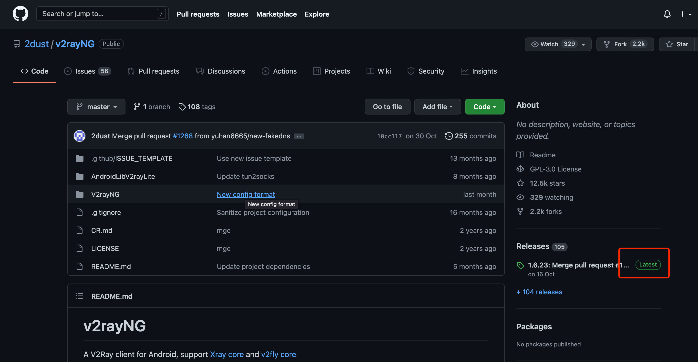
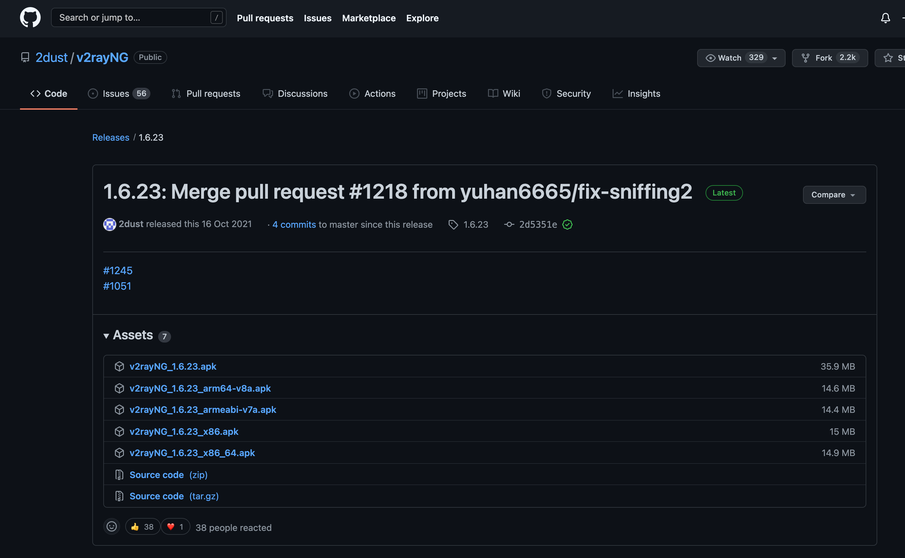
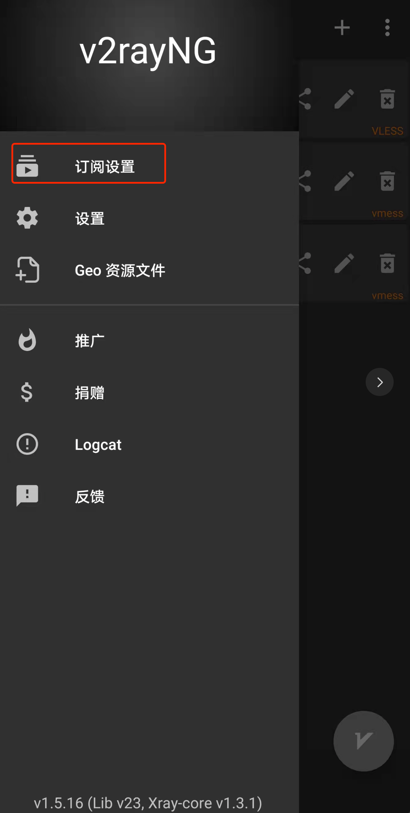
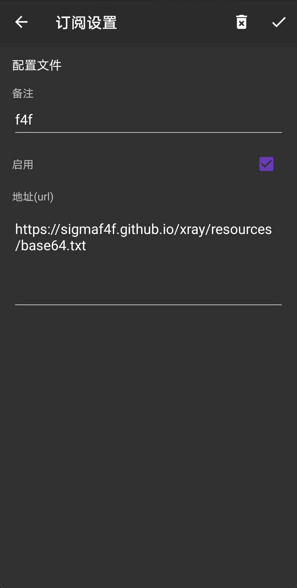
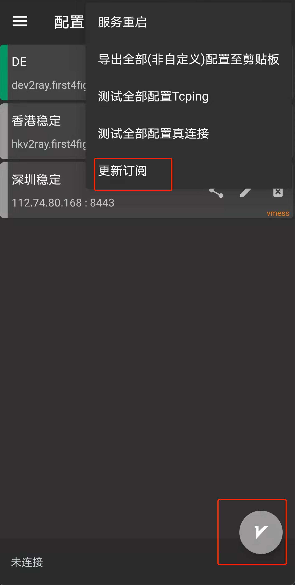

# Android 客户端设定

# 1.下载V2rayNG

> 这是下载地址 https://github.com/2dust/v2rayNG 下载最新版本

> 如果无法打开gihub，[点击这里下载](https://sigmaf4f.github.io/xray/resources/v2rayNG_1.6.23.apk.zip)

# 2.打开V2rayNG 

>点击左上角，订阅设置

备注可以随意命名

?>url: https://sigmaf4f.github.io/xray/resources/base64.txt

# 3.点击连通性测试，看到绿色数字后，点击第一行未连接开关，则连通

>点击右上角，更新订阅

>选择服务器，右下角为开关

根据要翻墙出境还是要，翻墙回大陆选择不同的服务器。（香港意味着翻墙出境，深圳意味着翻墙回大陆看爱奇艺等视频网站）

