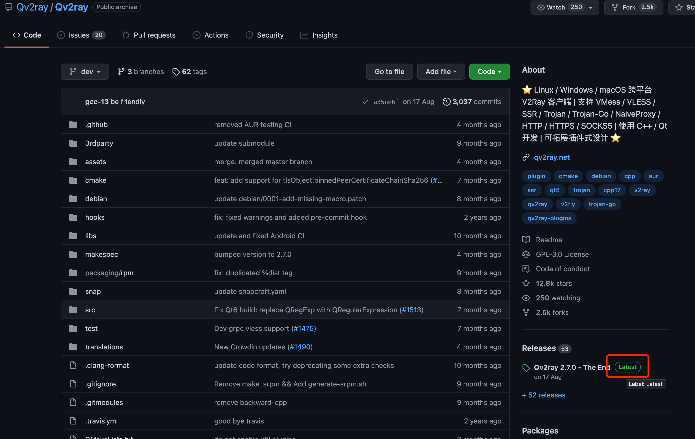
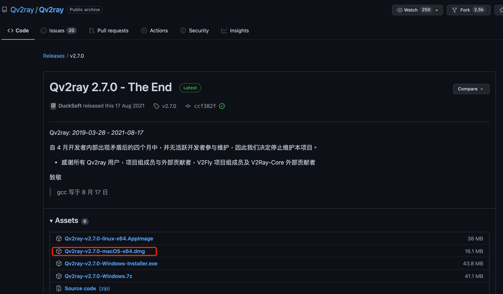
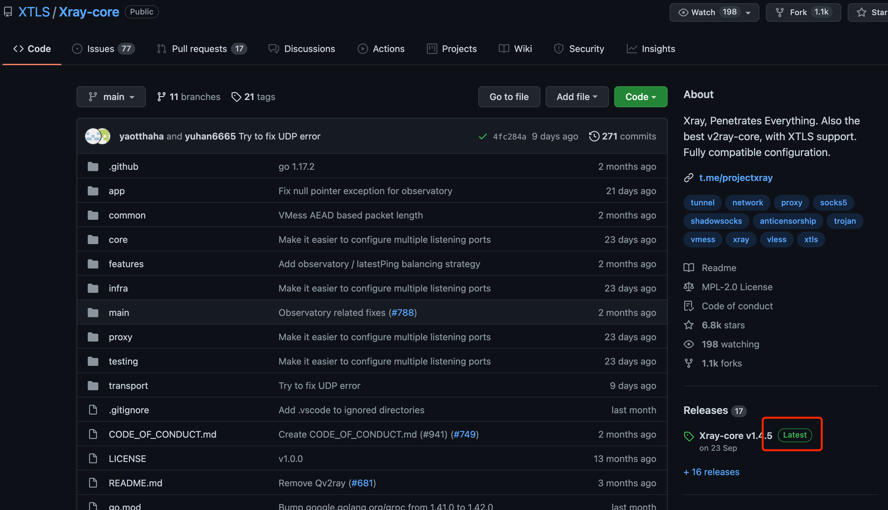
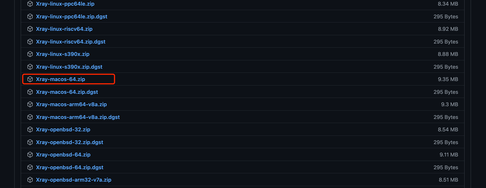
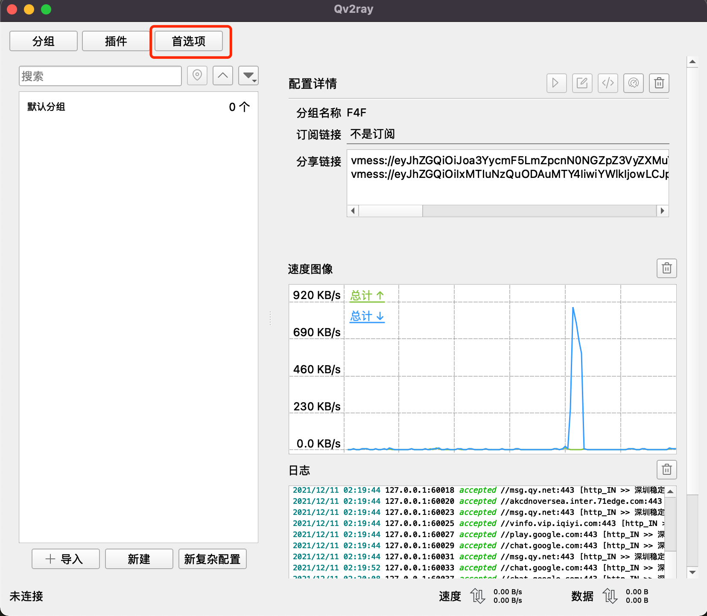
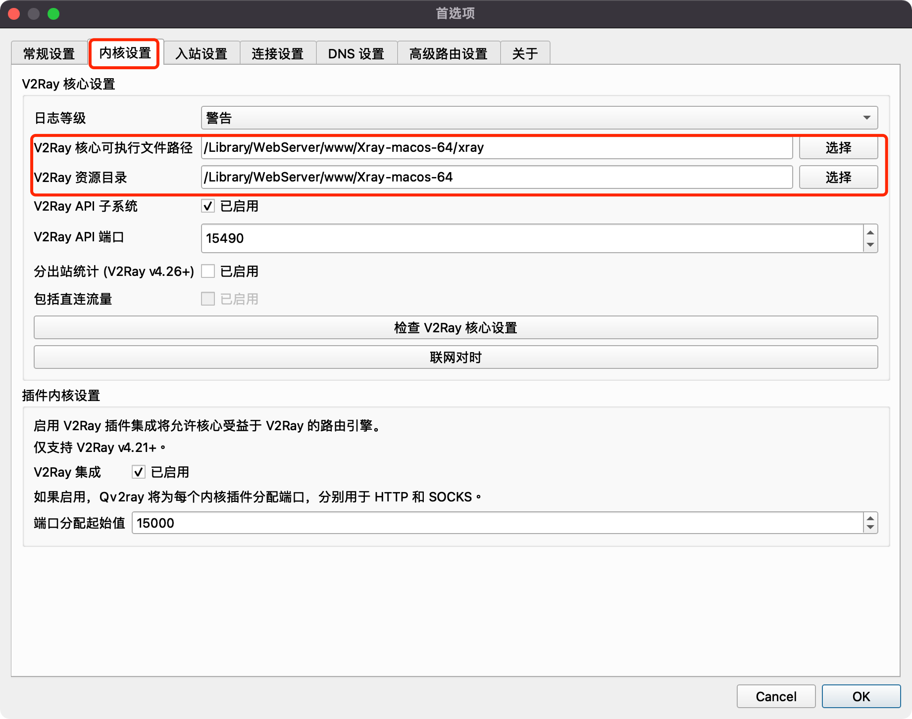
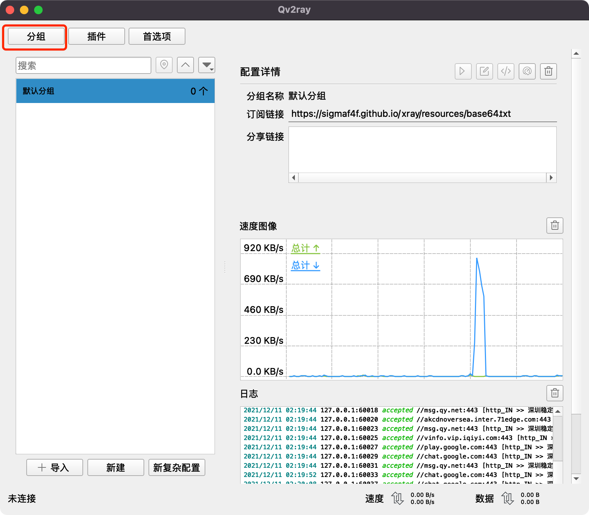
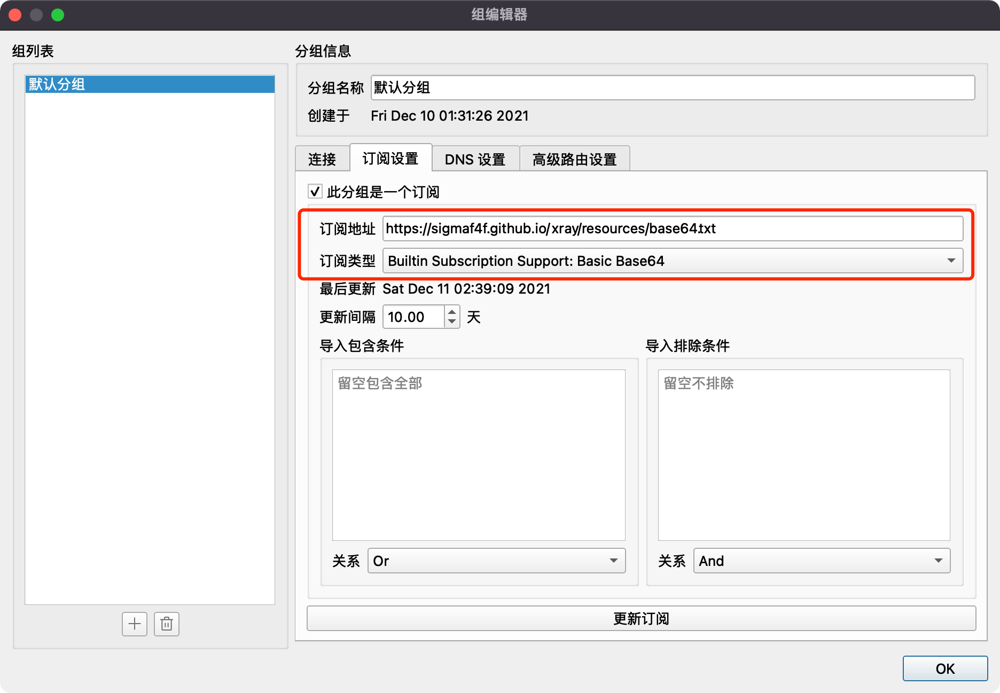

# Mac 客户端设定

# 1.下载Qv2ray

> 这是下载地址 https://github.com/Qv2ray/Qv2ray 下载最新版本

> 如果无法打开gihub，[点击这里下载](https://sigmaf4f.github.io/xray/resources/Qv2ray-v2.7.0-macOS-x64.dmg)

# 2.下载Xray

> 这是下载地址 https://github.com/XTLS/Xray-core 下载最新版本

> 如果无法打开gihub，[点击这里下载](https://sigmaf4f.github.io/xray/resources/Xray-macos-64.zip)

# 3.打开应用程序

> 点击首选项

> 内核设置，把执行文件和路径分别指向刚刚下载的xray

# 4.点击分组

> 订阅设置

?> 地址：  https://sigmaf4f.github.io/xray/resources/base64.txt

?> 类型：  base64

# 5.更新订阅

根据要翻墙出境还是要，翻墙回大陆选择不同的服务器。（香港意味着翻墙出境，深圳意味着翻墙回大陆看爱奇艺等视频网站）

