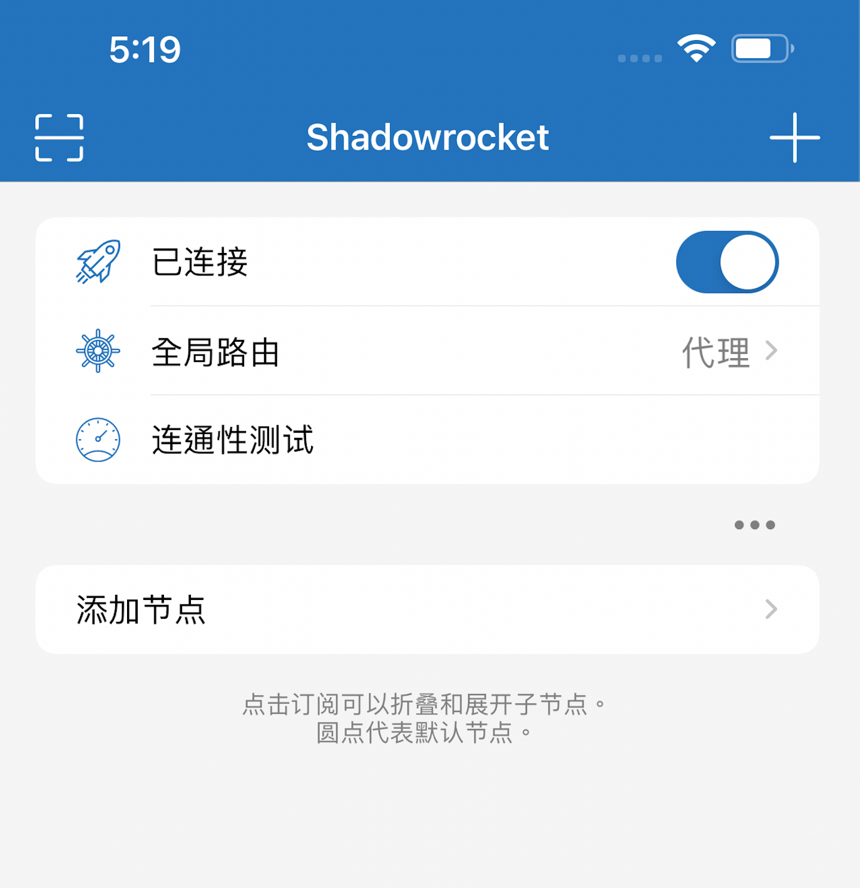
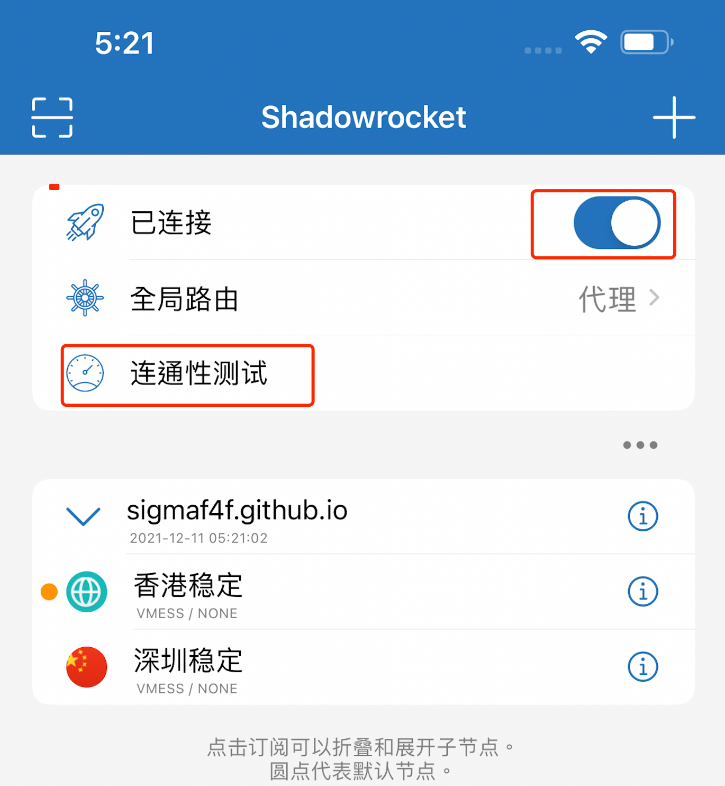

# Iphone 客户端设定

# 1.下载ios设备的v2ray APP

> 下述多款App均可使用推荐shadowrocket,也叫小火箭

| 描述 | APP Store 下载 | 非官方 |
| ------ | ------ | ------ |
| shadowrocket $2.99 | [Appstore(需要非大陆账号)](https://itunes.apple.com/us/app/shadowrocket/id932747118?mt=8)| [第三方(无需账号，免费)](https://free.shadowrocket.online/)|
| Kitsunebi $4.99 | [Appstore(需要非大陆账号)](https://itunes.apple.com/us/app/kitsunebi-proxy-utility/id1446584073?mt=8)| [第三方(无需账号，免费)](https://apps.kitsunebi.online/)|
| Quantumult $4.99| [Appstore(需要非大陆账号)](https://itunes.apple.com/us/app/quantumult/id1252015438?mt=8)| None |

说明：以上App均无法在Appstore中国区购买下载，您可以注册美区／香港区Appstore帐号，付款方式选none，帐单地址信息可于google地图获取，然后从淘宝购买GiftCards充值此Appstore帐号，再购买下载App

如果没有非中国区帐号，可通过第三方提供的方式下载，其原理是共享下载帐号，可按页面提示操作，放心使用

# 2.打开shadowrocket 

>点击左上角，扫描二维码

# 3.二维码

# 4.点击连通性测试，看到绿色数字后，点击第一行未连接开关，则连通

