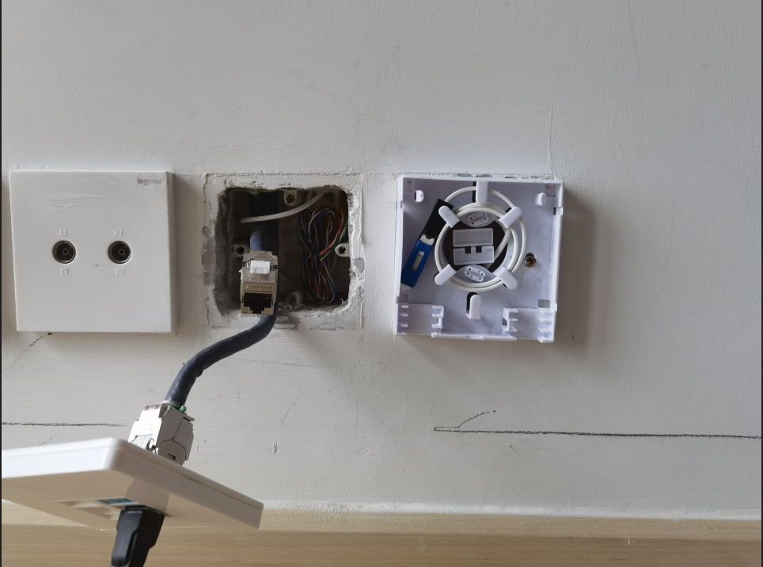
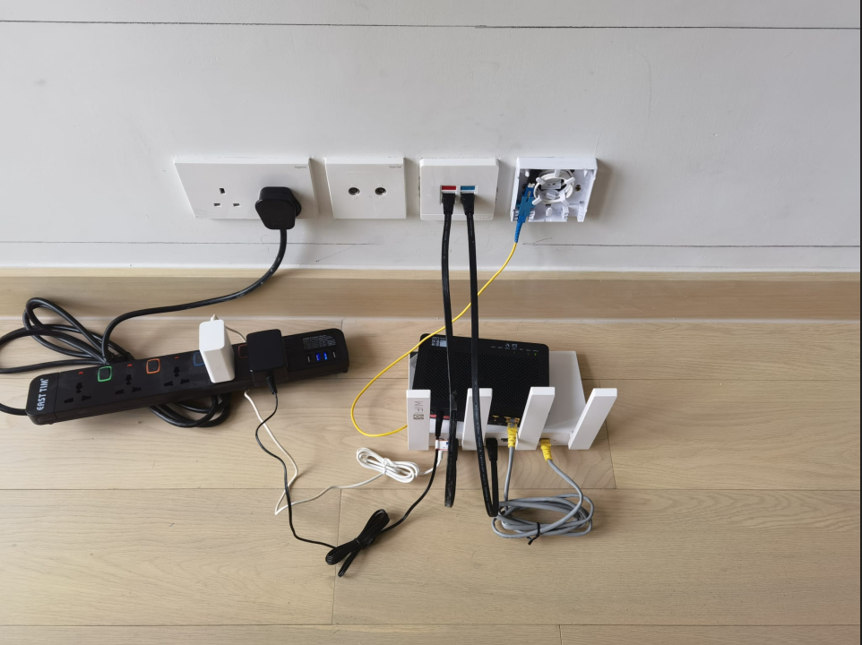
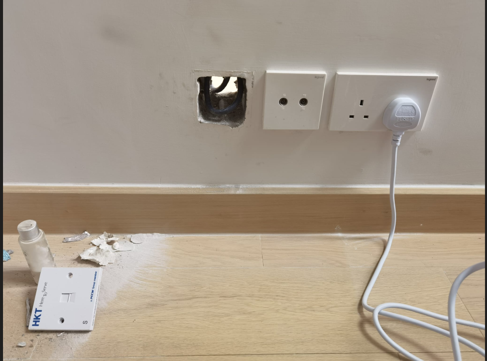
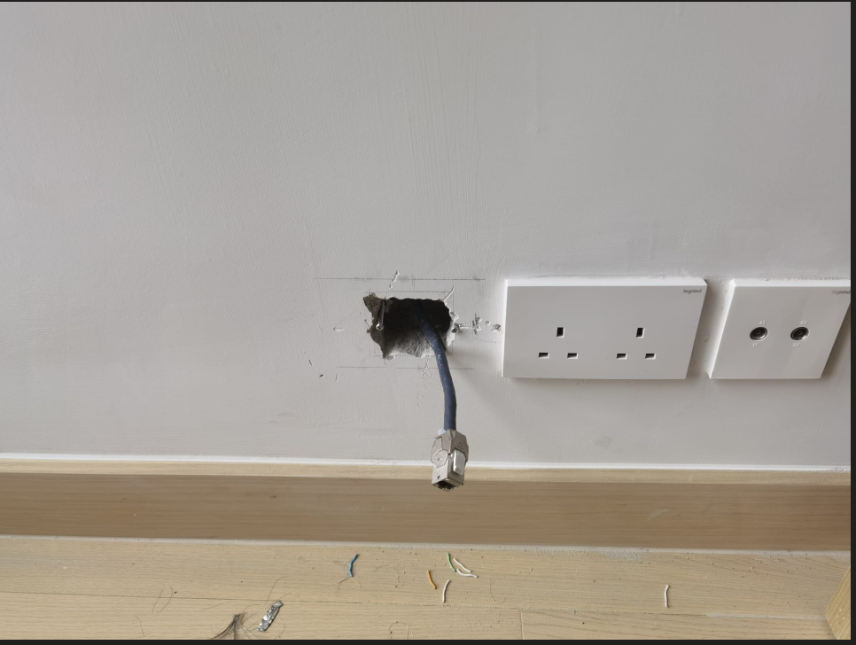
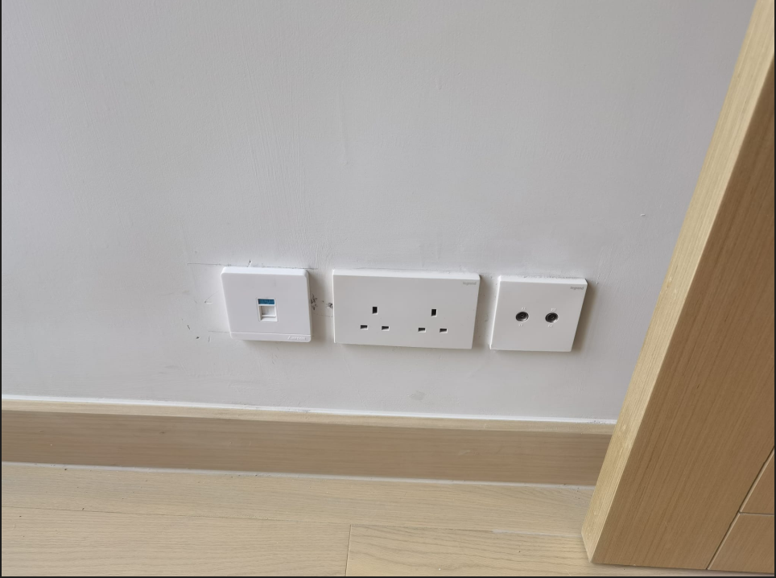
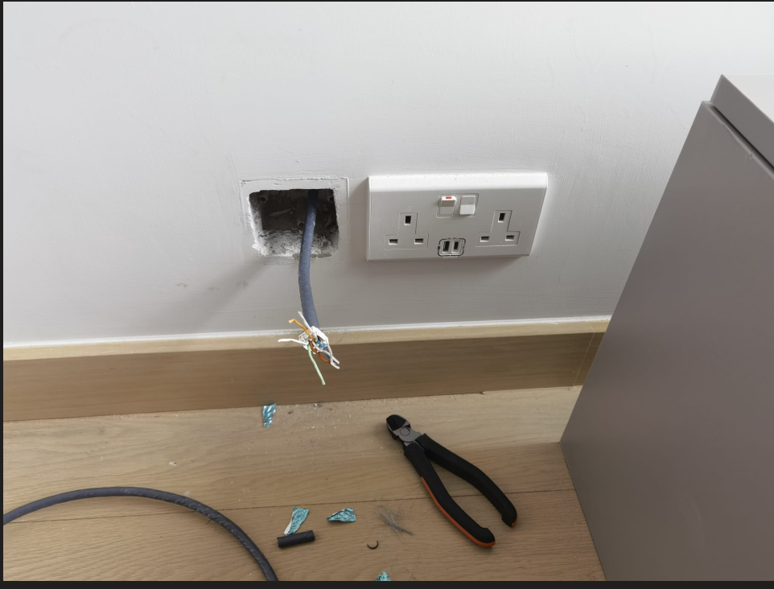
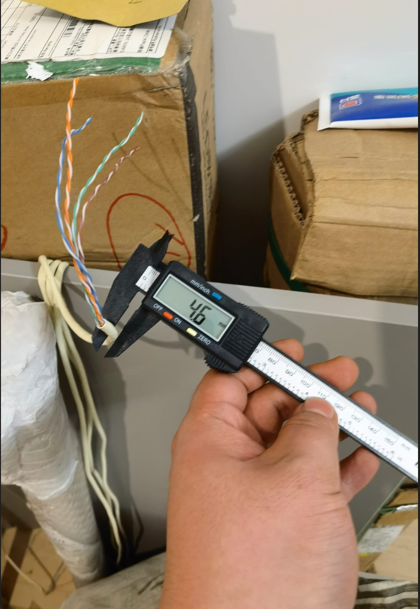
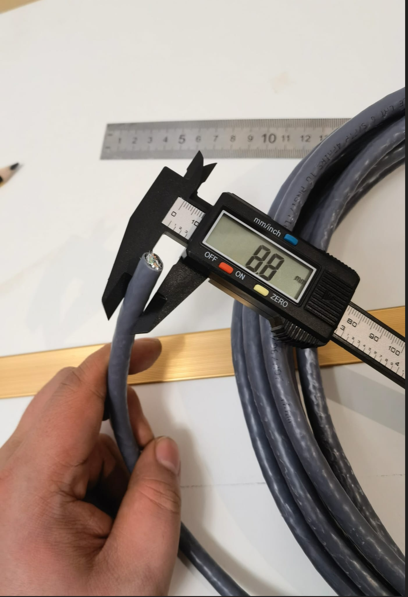

# 寬頻上網

而家可以選擇個寬頻有HKBN，HKT，HCG，速度同價錢差唔多

我今日將全屋網線換咗cat8，你間房，只有一條光線入來，無論HKBN定HKT定HGC，都係用同一個位置個光線入你間房，呢根光線個入屋位置，係發展商裝個，同邊間寬頻冇關。你見到房間內，有寫著HKT的面板，係屋內網線。對於入戶光線位置唔滿意個街坊，你個光線model位置係定死，冇的轉啦，除非你走換客廳墻內網線，好似我一樣。否則冇得轉，如果唔識，可以model擺一邊，wifi個router擺另一邊，呢種方法比較簡單。

如果一定要換邊，都有辦法，客廳墻內網線換光纖，但需要管線接駁機，因為我d客廳墻內係cat5線，將客廳墻內cat5線，換成光纖，用光纖接駁機，接駁入戶光線，咁m就可以做到model，同wifi都換邊啦

見到客廳有左右兩邊兩個寫著HKT個面板，其實佢係一條cat5網線由天花通兩邊，係屋內，同出邊無關，所以出面你簽約HKT，HKBN，HGC，都係唯一一個光纖口入屋，入來之後點m通，係家居網絡師傅個事。寬頻師傅唔會幫你，亦同你簽約邊間寬頻冇關。

為方便唔明個街坊理解，具體講，兩邊兩個暗盒，第一個暗盒兩條網線，一條通屋外（100M），一條通另一個暗盒。第二個暗盒，都係兩條網線，一條係同另一邊暗盒，一條通次臥，注意呢個暗盒同次臥個暗盒中兩條線係斷開，自己接駁好先通，用TIA/EIA-568B接法。唔識接駁，好似香港寬頻收400蚊接駁一條線。但而家冇人用100m網絡啦，你見到出邊全部都係800m，1000m光纖入屋。所以對於唔明網絡的街坊，可以咁m理解，廳左右兩邊既HKT 盒內net 線只係左右互通

我d發展商用噶原本就係cat5e線，1米1蚊左右100M速度，cat6線，1米3蚊左右1000M速度，cat7線，1米5蚊左右10G速度，cat8线，1米10蚊左右40G速度，呢幾樣都係網線，接駁用水晶頭1蚊1個。光纖係第二種嘢，線中間唔係導線係化纖玻璃，1米2蚊左右，但接駁唔係水晶頭，係一部機將兩段光纖中間個玻璃纖维熔化再冷卻對光。呢部機比較貴。水晶頭用個水晶頭鉗就可以做

at8網線同光纖係兩樣唔同嘢，速度都可以到40G即係4萬M，但cat8線係網線，傳輸係電，光纖傳輸個係光。因為基本材料唔同，所以cat8線可以打折可以彎曲可以供電可以用水晶頭自己接駁。光纖傳輸光信號，所以唔可以打彎唔可以供電唔可以自己接駁，但價錢平，因為唔係傳輸電所以冇信號衰減可以傳輸好遠。所以建大廈用光纖，屋內用網線。各個寬頻公司送比你個modem又叫光貓，係將光纖變成網線信號一個device。點m解我d有討論屋內換光纖？係因為我d光纖入屋，但有d業主希望梳化電視墻轉位，唔想梳化後面放modem或者wifi，所以將光纖拉去另一邊。如果只係網線，cat8線都係300蚊以內，我可以免費幫手，但光纖需要一部機器，我冇，只有請室內網絡工程公司，我解釋的明唔明。

補充少少，墻內線都有一條光線，香港寬頻同HKT都可以幫街坊換邊，但好似香港寬頻要收400，HKT免費

客廳換兩條線，一條通次臥，一條通主臥

打通客廳左邊到次臥

主人房

cat5e線

cat8線

> [cat8線購買link](https://detail.tmall.com/item.htm?id=621706976732&spm=a1z09.2.0.0.51e02e8dSaS7nj&_u=n155thb3f0b)

> [cat8面板購買link](https://detail.tmall.com/item.htm?id=659976750867&spm=a1z09.2.0.0.6f9b2e8dFOJfYZ&_u=s155thbca77)