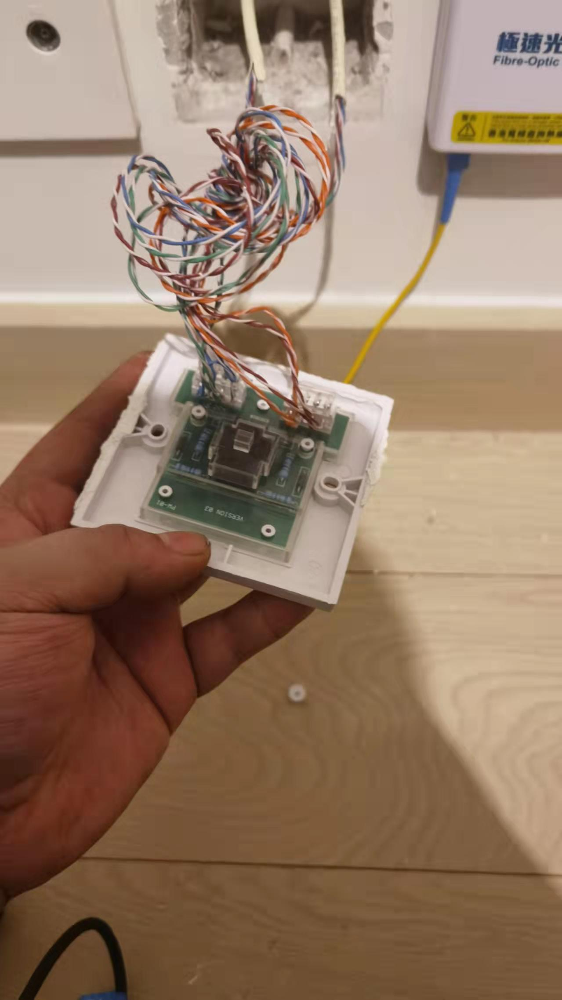
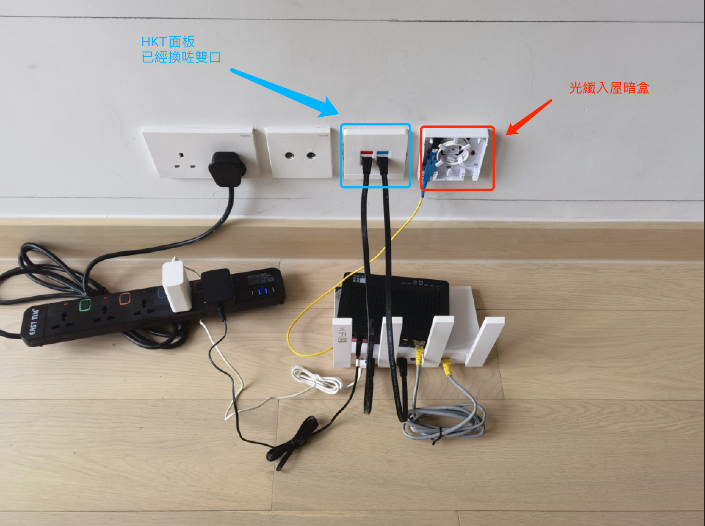
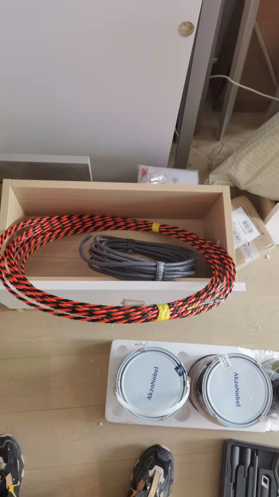
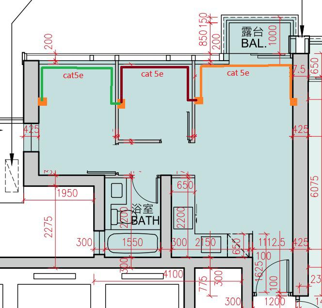
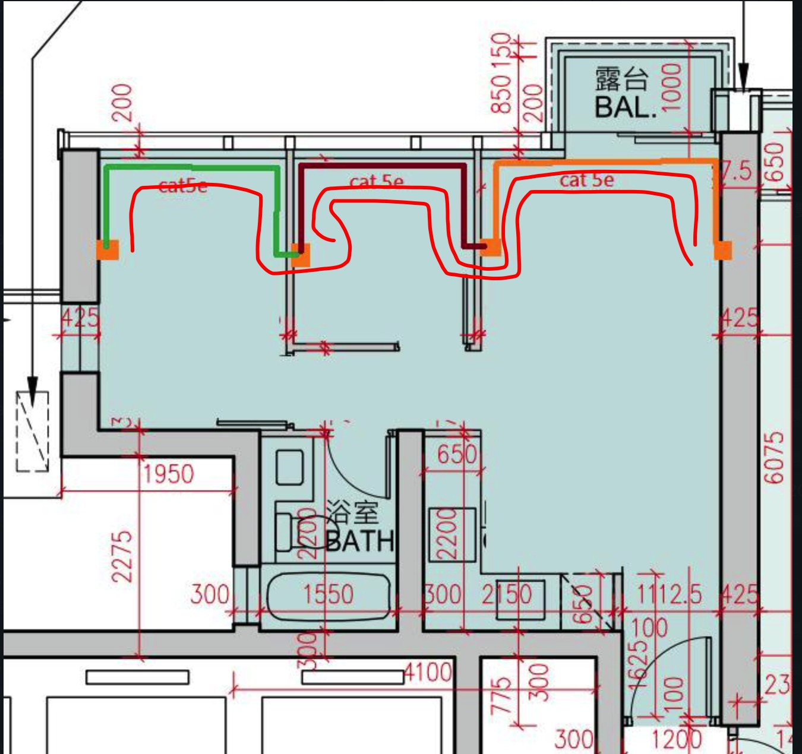
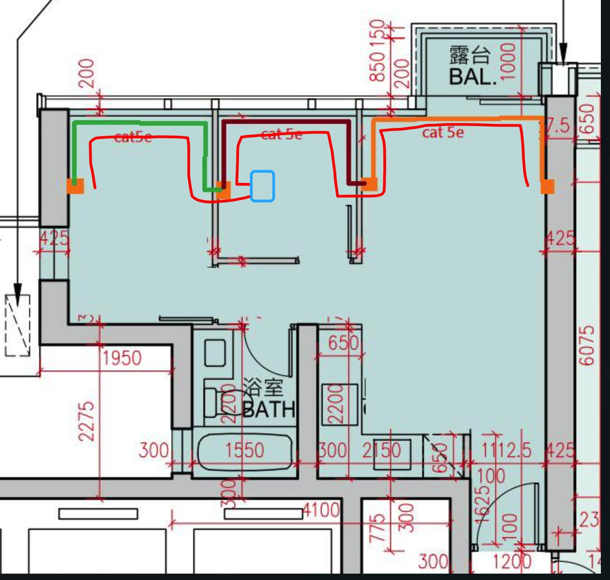
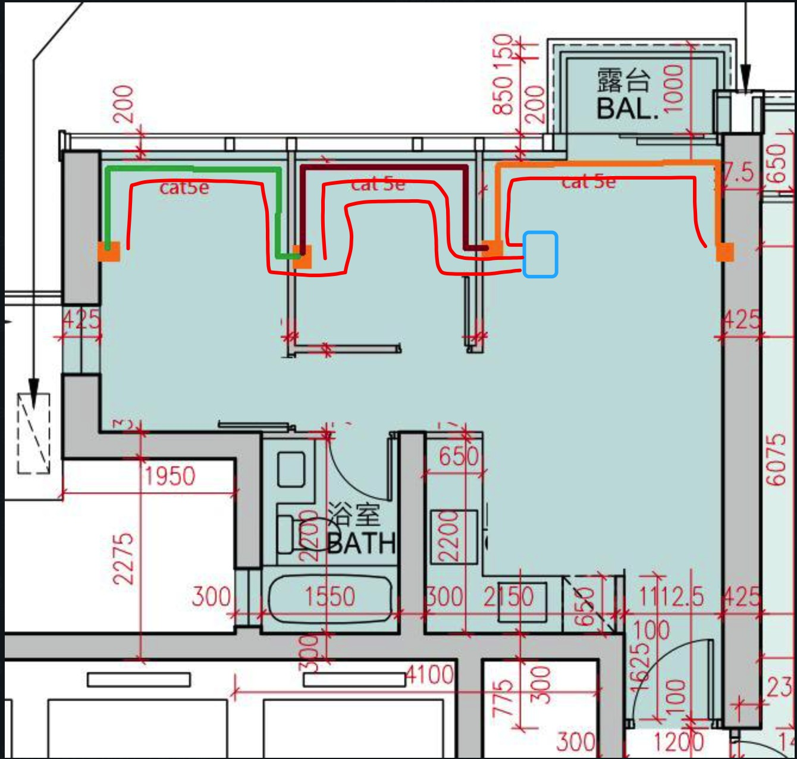

# 寬頻上網

而家可以選擇個寬頻有HKBN，HKT，HCG，速度同價錢差唔多

發展商通常都會設計，入屋光纖，即係modem擺電視墻果邊，電視墻通常係稱重墻。但因為風景關係，有d街坊，會將發展商設計個電視墻同梳化墻換邊，因為風景。其實咁m做未必好，因為客廳一邊係稱重墻，另一邊係空心墻，如果空心墻上掛電視，有機會有危險。如果電視唔上墻，其實冇乜分別，視乎風水同風景啦。

對於要換邊嘅街坊，你間房，只有一條光線入來，無論HKBN定HKT定HGC，都係用同一個位置個光線入你間房，呢根光纖個入屋位置，係發展商裝個，同邊間寬頻冇關。你見到房間內，有寫著HKT的面板，係屋內網線。對於入戶光纖位置唔滿意個街坊，你入屋光纖位置係定死，冇的轉啦，最簡單嘅辦法，可以model擺一邊，router擺另一邊，即係modem上光纖連接光纖暗盒，modem上網線連接hkt網線面板。另一邊hkt網線面板連接router。咁做就可以將router擺另一邊。

補充少少，上文講入戶光纖位置定死一定係主力墻，唔係話modem一定係主力墻。如果一定全部要換邊，需要光纖接駁機，聽街坊講，HKT可以免費幫你接駁光纖到另一邊，但hkbn要收400蚊先做。

見到客廳有左右兩邊兩個寫著HKT個面板，其實佢係一條cat5網線同一條光纖，由天花通兩邊，係屋內，同出邊無關，所以出面你簽約HKT，HKBN，HGC，都係唯一一個光纖口入屋，入來之後點m通，係家居網絡師傅個事。寬頻師傅唔會幫你，亦同你簽約邊間寬頻冇關。

為方便唔明個街坊理解，具體講，兩邊兩個暗盒，第一個暗盒兩條網線，一條通屋外（100M），一條通另一個暗盒。第二個暗盒，都係兩條網線，一條係同另一邊暗盒，一條通次臥，注意呢個暗盒同次臥個暗盒中兩條線係斷開，自己接駁好先通，用TIA/EIA-568B接法。唔識接駁，好似香港寬頻收400蚊接駁一條線。但而家冇人用100m網絡啦，你見到出邊全部都係800m，1000m光纖入屋。所以對於唔明網絡的街坊，可以咁m理解，廳左右兩邊既HKT 盒內net 線只係左右互通

我d發展商用噶原本就係cat5e線，1米1蚊左右100M速度，cat6線，1米3蚊左右1000M速度，cat7線，1米5蚊左右10G速度，cat8线，1米10蚊左右40G速度，呢幾樣都係網線，接駁用水晶頭1蚊1個。光纖係第二種嘢，線中間唔係導線係化纖玻璃，1米2蚊左右，但接駁唔係水晶頭，係一部機將兩段光纖中間個玻璃纖维熔化再冷卻對光。呢部機比較貴。水晶頭用個水晶頭鉗就可以做

cat8網線同光纖係兩樣唔同嘢，速度都可以到40G即係4萬M，但cat8線係網線，傳輸係電，光纖傳輸個係光。因為基本材料唔同，所以cat8線可以打折可以彎曲可以供電可以用水晶頭自己接駁。光纖傳輸光信號，所以唔可以打彎唔可以供電唔可以自己接駁，但價錢平，因為唔係傳輸電所以冇信號衰減可以傳輸好遠。所以建大廈用光纖，屋內用網線。各個寬頻公司送比你個modem又叫光貓，係將光纖變成網線信號一個device。點m解我d有討論屋內換光纖？係因為我d光纖入屋，但有d業主希望梳化電視墻轉位，唔想梳化後面放modem或者wifi，所以將光纖拉去另一邊。如果只係網線，cat8線都係300蚊以內，我可以免費幫手，但光纖需要一部機器，我冇，只有請室內網絡工程公司，我解釋的明唔明。

客廳換兩條線，一條通次臥，一條通主臥

打通客廳左邊到次臥

主人房

cat5e線

cat8線

穿線工具

> [cat8長線購買link](https://detail.tmall.com/item.htm?id=621706976732&spm=a1z09.2.0.0.51e02e8dSaS7nj&_u=n155thb3f0b)

> [cat8斷線購買link](https://item.jd.com/100009586763.html)

> [cat8面板購買link](https://detail.tmall.com/item.htm?id=659976750867&spm=a1z09.2.0.0.6f9b2e8dFOJfYZ&_u=s155thbca77)

# 拉線

發展商送我哋一對router，通常街坊係咁用無線mesh，即係一個主機，一個衛星，之間用無線mesh連接。其實咁做係自欺欺人，無線mesh最多應用於商場，球場等無遮擋地方，因為訊號衰減而多一部衛星增大訊號。我哋房間訊號差，速度慢。唔係因為信號衰減，而係有墻遮擋。本身係你個手機訊號差，速度慢，用咗個衛星router，依家變成衛星訊號差速度慢，雖然手機訊號滿格，但速度依然差。所以無線mesh等於自欺欺人。通常我哋所謂拉線，係指用有限mesh。

寬頻有一根光纖入屋，然後接駁modem，modem接駁主路由，主路由通過lan線，接駁到客廳面板，面板內cat5e線，接駁入房內面板，然後再接駁衛星router。咁做就可以另全屋wifi無死角。

cat5線100m，cat5e線100m-1000m，cat6線1000m，cat6e線1000m-1萬m，cat7線1萬m，cat7e線1萬-4萬m，cat8線4萬m。5年前，香港只有200-500m，10年前只有8m-100m，依家1000m已經普及，5年後？10年後？

網速遵循木桶原理，成水量同最短板有關。網線，router，modem，光纖，合約，上網device。你最後使用感受個網速，同其中最慢速度有關。

如果決定拉線，我以一位街坊戶型為例。

原本墻內線。

方案1 有客廳拉兩條線，一條去細房，一條去主人房

方案2 有客廳拉一條去細房，細房加多一部交換機，一條由細房去主人房，呢種方案多見於3房或者4房單位，因為cat8線8.8mm，而我的墻內pvc管20mm，最多只可以走2條cat8，所以需要交換機解決唔可以多拉線個問題，交換機可以再接駁衛星路由都得，或者電腦都得，視乎幾多個port

方案3 對應多數需要客廳換邊而入屋wifi反而靠近細房，或者電視對面唔放梳化反而要放部電腦情況，呢種類型我係1AB單位見到，詳細可以問我

仲有其他方案例如打穿非主力墻，係另一邊細房安裝多個面板，主要應對係細房需要換邊個問題。
