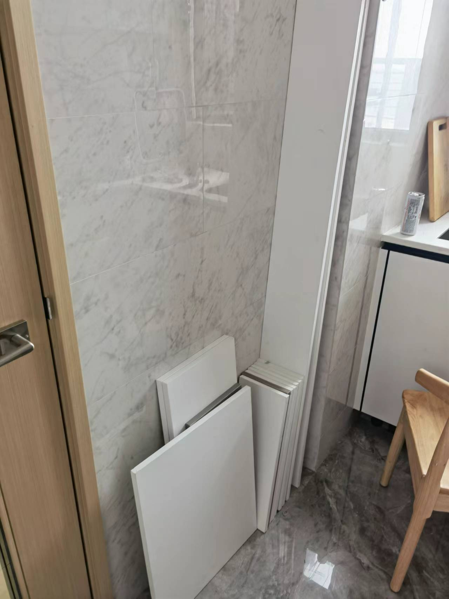

# 改裝

# 1 明線

由於傢私擺位關係，有地方要使用明線，有地方要改動插蘇位置

呢個係明線做法，網線加一條插線板

電動窗簾明線

> [購買link](https://item.taobao.com/item.htm?spm=a1z09.2.0.0.51e02e8dSaS7nj&id=621546804819&_u=n155thb243f)

推薦一個插線板，非常好用，大陸香港通用，有USB，有Type-C

> [購買link](https://item.taobao.com/item.htm?spm=a1z09.2.0.0.51e02e8dSaS7nj&id=619765307505&_u=n155thba3cc)

# 2 插蘇

改動插蘇，傢私背板開槽，第一種做法

第二種做法

<video src="https://sigmaxy.github.io/decoration/images/modify/2-2.mp4" controls="controls"></video>

# 3 普通吊燈改智能燈

雖然依家市場上智能吊燈都比較多款式，但是始終普通吊燈更加多，理論上任何普通吊燈只需要一個40蚊智能繼電器就可以變智能燈

> [購買link](https://item.taobao.com/item.htm?spm=a1z09.2.0.0.343f2e8dsiJxn9&id=610210019661&_u=m155thb8f3c)

打開普通吊燈背面，你會見到一個controller集成變壓器，有哋controller有智能，有哋有遙控

呢d唔總要，關鍵睇佢有幾條output，呢d係控制幾個單獨LED燈膽，一個LED燈膽需要一條火線，2條控制線（白光同暖光），火線可以並聯

如果見到4條或者5條output，只用講其中2-3條火線並聯，接入智能controller火線output，其他兩條控制線接駁智能controller白黃控制線。然後前內電源線接駁智能controller嘅input。

呢哋controller有好多平台，homekit，米家，華為，天貓。買對應自己常用個平台就ok，普通吊燈就變智能燈啦

# 4 除濕機水路

香港地濕氣好重，尤其我哋屋苑臨海，回南天可能80%以上濕氣，除濕機會係大多數人必須產品

但除濕機每日需要倒水，好麻煩，我個做法，係電視機櫃或者其他街坊係梳化下面加多一條排水管，係露台門框打個窿

就可以排水到露台，唔洗日日倒水啦，除濕機可以24小時開，或者用智能除濕機，濕度到一定先開

# 5 碗架

分享一個廢物利用個過程，傢私安裝過程中，會有一哋邊角料或者廢板，我諗利用呢d廢板做少少嘢。

做個板凳當練習一下

設計一個碗架，呢度要多謝Leo爸爸教我用台鋸，先可以鋸到直線，我自己用曲線鋸點都鋸唔直

上三合一螺絲

組裝層板

裝好櫃門，護欄，隨意停等五金，拖板接駁電源，廚房有個碗架啦

# 6 瓷磚打窿

首先用瓷磚定位鑽頭，打一個小小釘，然後用瓷磚鑽頭打穿瓷磚，最後用石屎鑽打墻面

用個水樽，瓶蓋打個窿，打瓷磚過程要不停加水

最後打出來個窿，一滴都唔爆邊

呢d係洗手間置物架

# 7 電動升降枱

分享一個改裝智能家電，我買咗個電動升降書桌，但查返市場上所有電動升降台或者榻榻米，冇一間有智能功能，都係呢種物理按鍵，冇得接駁米家或者homekit，冇辦法自己改造。

準備工具

購買一個65蚊嘅智能繼電器，有米家有蘋果HomeKit

> [購買link](https://item.taobao.com/item.htm?spm=a1z09.2.0.0.3d0c2e8d0tbAm8&id=629916152179&_u=a155thb37d0)

拆開控制面板，一個變壓器，兩個PCB板，其中一個控制板，一個顯示功能板

接駁變壓器電源，同兩路控制按鍵

我嘅電動升降台變智能啦，已經可以設定場景，聯動音箱，手機，或者久坐提醒

<video src="https://sigmaxy.github.io/decoration/images/modify/7-6.mp4" controls="controls"></video>

# 8 電解除鏽

我哋面海潮濕，好多金屬容易生鏽，分享一個係屋企除鏽辦法。需要準備工具：一個廢棄充電插座，一個螺絲，兩條電線，一個金屬片，一包蘇打粉（冇蘇打粉用鹽代替都得）。

我有個鑿子，係買電子鎖工具時候，賣家送嘅，一場雨即刻生鏽，肯定平嘢。現在用電解除鏽方法令佢煥然一新。

螺絲扭入插座中間，呢個係正極，出邊係負極。正極接金屬，負極接要除鏽金屬，放入蘇打水中。

半個鐘之後拎出來，放心，正常充電器都係5-20v，唔會對人體造成任何傷害，直接用手入水都冇事。

前後比較下

# 9 門吸

我有用過兩款門吸，一款磁石，一款機械結構。我感覺會推薦呢個機械結構，因為磁石款係廚房如果雙手有拎碗碟，用隻腳關門唔方便。用機械結構只要蹬一下門，就自動關門了。

<video src="https://sigmaxy.github.io/decoration/images/modify/9-1.mp4" controls="controls"></video>

> [機械購買link](https://detail.tmall.com/item.htm?id=640818848044&sku_properties=122276380:20213)

> [磁石購買link](https://detail.tmall.com/item.htm?spm=a230r.1.14.35.c57bae27JLHNu1&id=658601836473&ns=1&abbucket=3)

> [塑膠購買link](https://detail.tmall.com/item.htm?id=669295169906&sku_properties=122276380:20213)

# 10 隔音條

打風時候，因為樓道通風問題，我哋個大門會發出vv聲，其實只不過係我哋個門吹緊口哨。只要阻風透入就可以解決呢個問題。購買時候會見到有9*4，9*6，9*8多仲規格，第一個係寬9mm，第二個digit係厚度6mm。要根據自己門縫size來選擇，如果size選細，可能仲有聲，如果選大咗，關門收影響。我呢個單位門框4邊，上左右選擇9*6啱啱好，下選擇9*8.唔同單位門縫唔同，如果唔識度尺，可以都買一個，反正好平。

<video src="https://sigmaxy.github.io/decoration/images/modify/10-2.mp4" controls="controls"></video>

> [購買link](https://detail.tmall.com/item.htm?id=634607551467)

