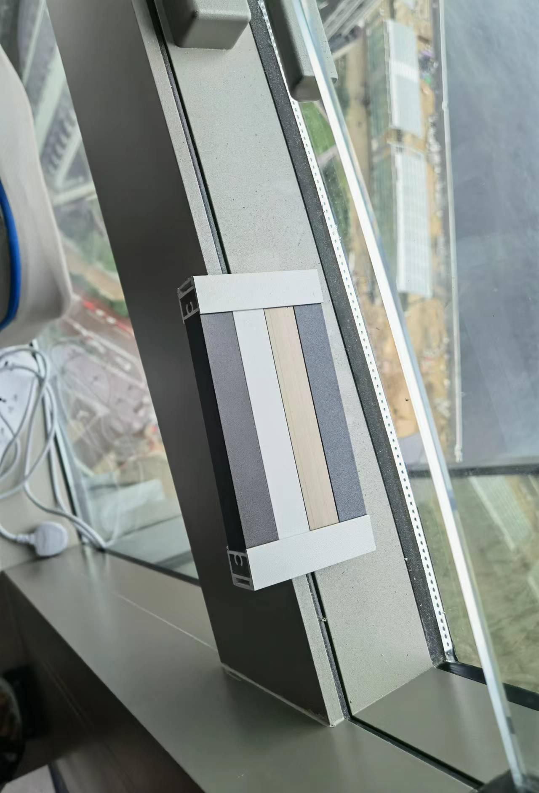
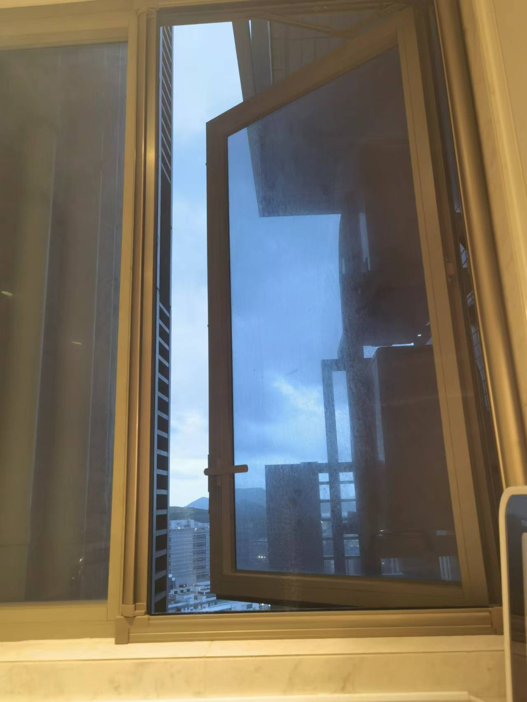
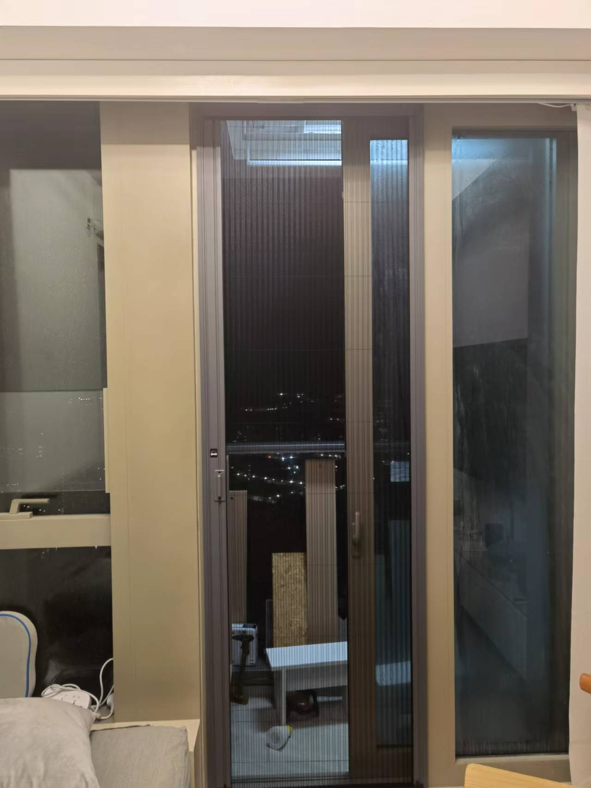
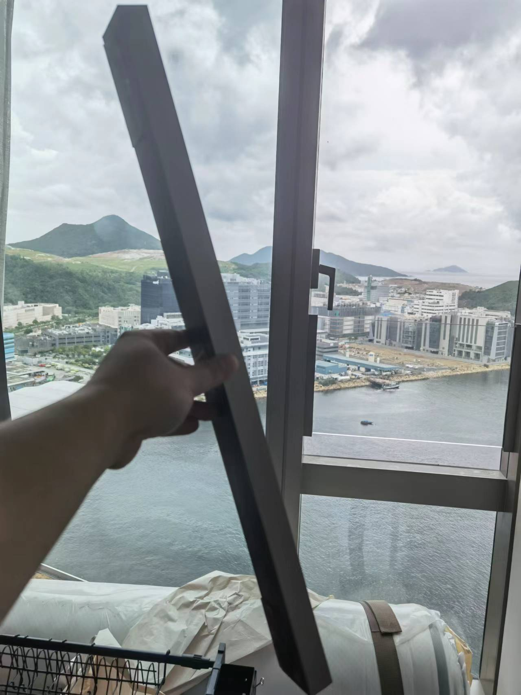
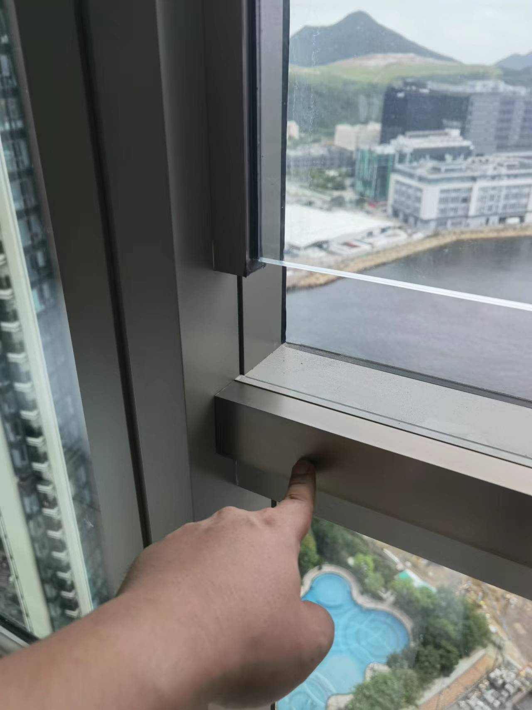

# 蚊網防貓網

蚊網主要材料有尼龍，不鏽鋼，PET3種。

尼龍白色透光比較好，但唔可以防貓防狗，不鏽鋼透光唔好，但可以防貓防狗。PET透光好，有可以防貓狗，但加錢比較貴

通常香港蚊網以天驕為例，一扇門，三扇窗要去到8-9千左右。沐川平少少，一扇窗去到900幾。

我深圳業主群一位街坊推薦一間深圳鋪頭，專門做深圳香港蚊網

PET材料，一扇窗客廳，睡房或者廚房都係598，露台門係2198，單買一扇窗一扇門都得.包運輸費，唔包安裝。如果需要安裝，香港上門安裝，師傅錢另計算。不過佢有三種安裝方法。3M貼，鋁合金結構膠，鑽窿。

呢個係佢郵寄過來色板，選擇顏色

一扇門3M貼安裝需要1分鐘左右，結構膠需要5分鐘左右，鑽窿擰6個螺絲需要10分鐘左右。咁m簡單我就唔請師傅拉，自己鑽窿，始終覺得螺絲最穩陣，佢哋會開好螺絲窿，並配螺絲比你，用電鑽或者電動螺絲批直接扭係鋁合金框架上。

選擇蚊網時候會見到一個參數叫目，12目，20目，24目，48目等等，目數意思係每平方英吋有幾多個窿。1平方英寸=645平方毫米，48目即係48個窿，645/48=13.4。每個窿13.4平方毫米，假設每個窿正方形，13.4開square root=3.6。即一個正方形窿邊長3.6mm，減去兩條1mm邊= 1.6mm。即係話48目可以防止長度超過1.6mm蚊蟲，宜家google下你想防止個蚊蟲size幾長，就知啦。目數越高防止蚊蟲約細，不過透光度約低。

我選擇係20目，呢個係廚房效果

客廳效果，客廳係48目。

<video src="https://sigmaxy.github.io/decoration/images/mosquito/2-1.mp4" controls="controls"></video>

睡房因為有兒童玻璃，所以需要一個25*38鋁合金方管。

將鋁合金方管安裝係兒童玻璃下面窗框，使兒童玻璃同方管係同一個平面，就可以安裝蚊網啦。

安裝完成

<video src="https://sigmaxy.github.io/decoration/images/mosquito/4-1.mp4" controls="controls"></video>

佢哋唔係淘寶鋪頭，需要可以微信我，我推微信比你.

佢哋加咗你微信之後，需要你自己拎把呎，同佢哋微信視訊，跟著佢讓你度邊度，你度邊度，就ok啦，做好之後會順豐直接發貨到marini唔洗轉運，製作需要3-5日，運輸需要3-5日。如果需要師傅上門擰螺絲，需要再約師傅。不過6粒螺絲讓師傅上門，我覺得成千蚊扭螺絲有滴唔抵。

