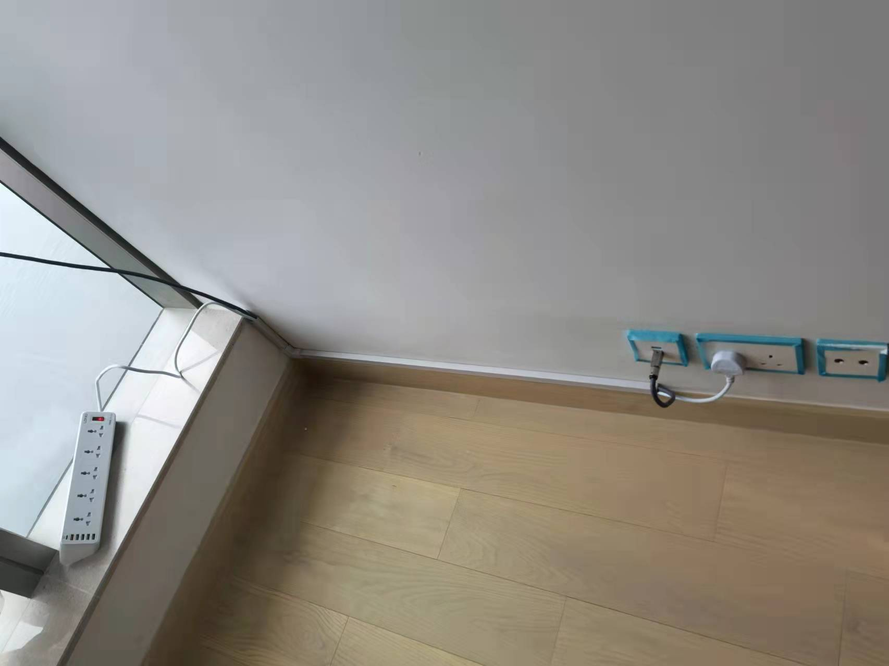
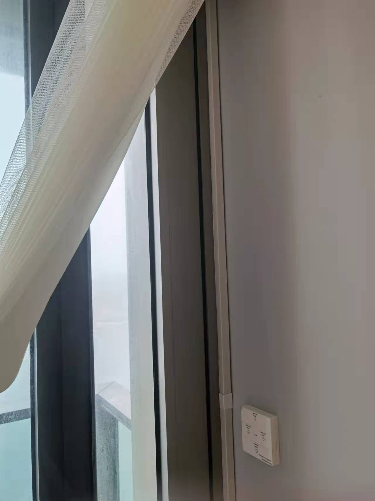
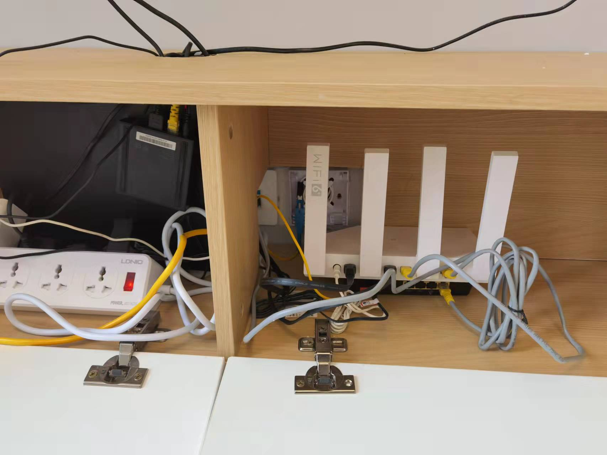

# 插蘇明暗線

# 明線

由於傢私擺位關係，有地方要使用明線，有地方要改動插蘇位置

呢個係明線做法，網線加一條插線板

電動窗簾明線

> [購買link](https://item.taobao.com/item.htm?spm=a1z09.2.0.0.51e02e8dSaS7nj&id=621546804819&_u=n155thb243f)

推薦一個插線板，非常好用，大陸香港通用，有USB，有Type-C

> [購買link](https://item.taobao.com/item.htm?spm=a1z09.2.0.0.51e02e8dSaS7nj&id=619765307505&_u=n155thba3cc)

# 插蘇

改動插蘇，傢私背板開槽，第一種做法

第二種做法

<video src="https://sigmaxy.github.io/decoration/images/panel/3.mp4" controls="controls"></video>

