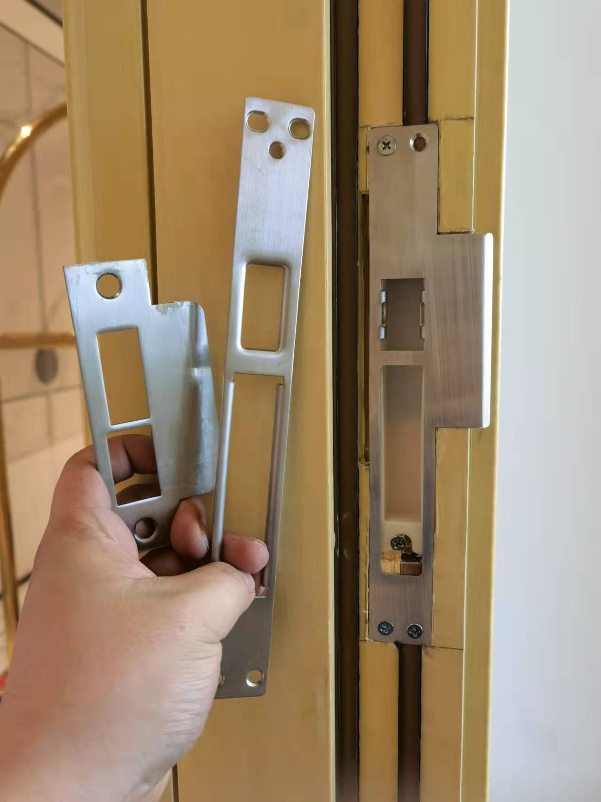

# 智能平台

市場上做智能平台好多，有5間比較大廠做，產品比價多，小米（米家），華為（AI Life），蘋果（HomeKit），三星（SmartThing），百度（天貓精靈），通常先選平台，選定平台，再開始選產品，因為唔同產品，可能僅僅support一兩個平台。例如小米同華為通常唔會support對家

我呢度所有工具都有，都可以免費借比街坊，所有用電芯個嘢，都可以免費幫街坊安裝，但我冇點工牌，如果需要220v，我可以企街坊隔離指揮，唔可以上手，因為犯法。目前都裝咗3個電子鎖，4個智能窗簾，燈同智能晾衣架。

我主要產品選咗小米，小米主要做大陸，美國，印度市場，香港市場只有唔到5%嘅小米產品，同埋功能會少，例如小米電視，智能鎖，電鑽，智能窗簾等我推薦個產品，只有大陸，美國，印度先有的賣，香港小米旗艦店無。並非所有小米產品都值得推薦，我當初選小米，因為我有選擇困難症，如果淘寶search一下，成千個產品，小米通常只有黑白兩個產品二選一，同埋佢性價比高。我當初買咗2盞小米智能吸頂燈，而家後悔，因為小米智能吸頂燈，唔support凌動開關，我要重新49蚊買個智能凌動斷路器，先可以改裝到凌動智能效果，我遲d會係智能燈篇章，詳細講解。

小米電器轉大陸server係米家APP》我》設置》地區》選擇中國大陸。

我會將安裝步驟，圖片放下面

# 1 智能門鎖

我見到街坊有團購智能門鎖，都需要3800到5千幾唔等，可以網上自己購買，我來幫街坊免費安裝，以小米智能鎖為例，我買呢款有攝像頭，有password，有NFC，攝像頭電池同門鎖電池分開，有人臉標識。原價2199，天貓年貨節1999.

我覺得小米鎖設計好嘅地方，小米鎖有8粒電池加一個鋰電池，但只需要4粒就可以用。4粒冇電，手機通知，開始用另外4粒，鋰電池for攝像頭，可以延長鎖電時間。每次換4粒電池。如果冇電，有鎖匙，門外有typec充電口，可以直接用尿袋。但注意通常電子鎖包括小米都係C級鎖芯，如果用手機APP反鎖之後，屋內斷網，鎖匙又唔見，就冇得開鎖，只可能暴力破門啦。

關於鄰居投訴小米鎖自帶錄影，防盜眼，米家AI咁m解決法律問題，如果鄰居從你門口路過，唔會錄影，如果係門口逗留，做奇怪動作，先開始錄影

呢個係扣片

扣片設計

呢個係導向片，由左至右依次係原裝導向片30200，小米默認送個導向片20240，自己淘宝購買導向片30240

> [智能鎖購買link](https://www.mi.com/buy/detail?product_id=14467&cfrom=search)

> [導向片、扣片購買link](https://item.taobao.com/item.htm?spm=a1z09.2.0.0.56432e8ddB7aT2&id=613821459277&_u=3155thb836c)

# 2 智能電視

電視差價最大，我呢款小米65吋OLED，8499，同樣以Samsung A65，豐澤2萬3，淘寶8千9，運費400幾。如果怕壞怕麻煩，建議豐澤，如果想慳錢，淘寶

<video>
    <source src="https://sigmaxy.github.io/decoration/images/smart/2-1.mp4" type="video/mp4">
</video>

<video src="https://user-images.githubusercontent.com/4843869/155229150-0dd4ace0-66a6-43ba-beb9-1bc4b2b5a3ed.mp4" controls="controls" style="max-width: 730px;">
</video>

我呢款小米65吋，有兩款，60Hz，六千幾，120Hz先8千幾

> [購買link](https://www.mi.com/buy/detail?product_id=14779)

# 3 智能開關

<video src="https://sigmaxy.github.io/decoration/images/smart/4-1.mp4" controls="controls" style="max-width: 730px;">
</video>

# 4 智能吊燈

餐廳位吊燈需要改位，補窿

<video src="https://user-images.githubusercontent.com/4843869/155232499-6d63feb1-40f1-4774-87e7-de894cca950a.mp4" controls="controls" style="max-width: 730px;">
</video>

<video src="https://user-images.githubusercontent.com/4843869/155232538-a4248fa9-ca7b-4927-a6ac-8cfe2878485a.mp4" controls="controls" style="max-width: 730px;">
</video>

> [購買link](https://www.mi.com/buy/detail?product_id=11041&cfrom=search)

# 5 智能晾衣架

小米晾衣架主機

安全繩纏繞位置

<video src="https://user-images.githubusercontent.com/4843869/155229777-62e5476b-83c1-4541-82a1-d1447313f326.mp4" controls="controls" style="max-width: 730px;">
</video>

<video src="https://user-images.githubusercontent.com/4843869/155229816-7a204033-2976-4cdf-8d75-8a8050327fea.mp4" controls="controls" style="max-width: 730px;">
</video>

> [購買link](https://www.mi.com/buy/detail?product_id=11041&cfrom=search)

# 6 智能窗簾

<video src="https://user-images.githubusercontent.com/4843869/155230011-dad9f034-d75b-420c-a7ac-baef7904a463.mp4" controls="controls" style="max-width: 730px;">
</video>

> [購買link](https://item.jd.com/100014743067.html)

# 7 智能門窗感應

<video src="https://user-images.githubusercontent.com/4843869/155229544-827a972b-a135-42cd-a0f4-214ac706d2ea.mp4" controls="controls" style="max-width: 730px;">
</video>

> [購買link](https://www.mi.com/buy/detail?product_id=12665&cfrom=search)

# 8 人體感應

# 9 溫濕度感應器

# 10 智能除濕機

# 11 掃地機器人

# 12 洗地機

# 13 智能門禁

原本PCB設計同電話

# 14 智能無線調色開關

> [購買link](https://www.xiaomiyoupin.com/detail?gid=107044&pid=43141)

# 智能場景

| 场景 | 条件 | 执行 |
| ------ | ------ | ------ |
| 离开家 | 锁门 | 关灯，清扫，开窗一小时，关闭空调电视 |
| 回家家 | 指纹开锁 | 开灯，停止清扫，关窗帘，打开空调电视 |
| 早起 | 闹钟响 | 开窗帘，早餐机，开厕所灯 |
| 进入厨房 | 人体感应 | 开灯 |
| 进入卫生间 | 人体感应 | 开灯 |
| 离开厨卫 | 人体感应 | 关灯 |
| 抽湿控温 | 温湿度感应 | 除湿机，空调联动 |
| 下雨 | 水浸感应 | 降低晾衣架，关窗 |
| 监控 | 本人不在家 | 开启监控|
| 监控 | 陌生人在门口 | 开启监控|
| 报警 | 女友出现门口 | 门锁摄像识别，手机通知|	

