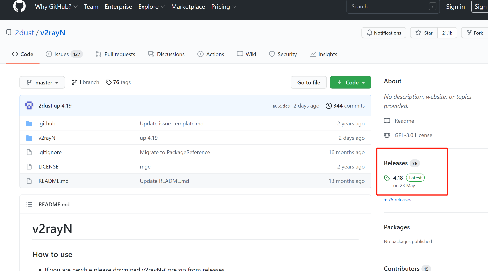
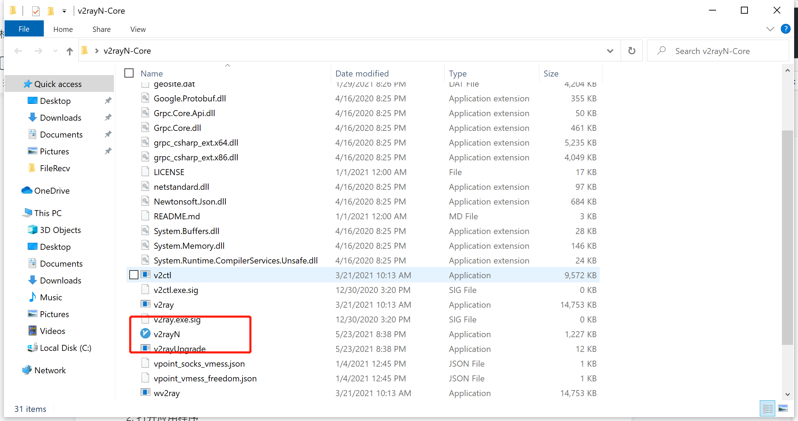
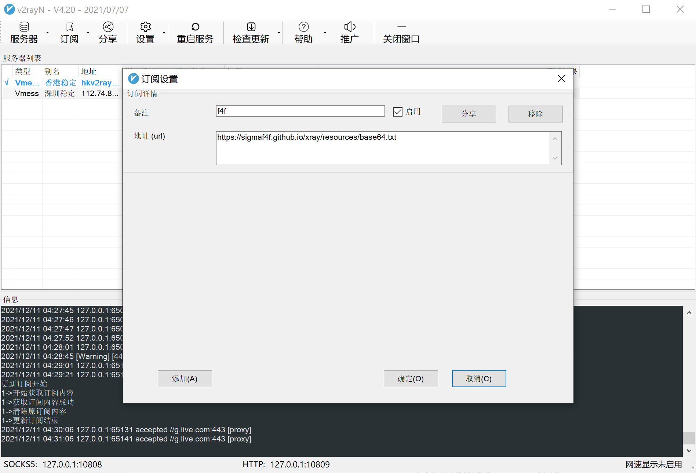
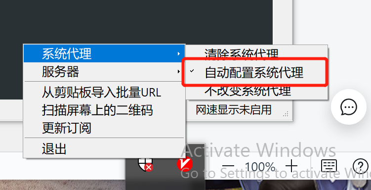

# Windows 客户端设定

# 1.下载V2rayN

> 这是下载地址 https://github.com/2dust/v2rayN 下载最新版本

> 如果无法打开gihub，[点击这里下载](https://sigmaf4f.github.io/xray/resources/v2rayN-Core.zip)

# 2.打开应用程序

# 3.点击订阅

备注可以随意命名

?>url: https://sigmaf4f.github.io/xray/resources/base64.txt

# 3.更新订阅

>先更新订阅，再选择服务器

根据要翻墙出境还是要，翻墙回大陆选择不同的服务器。（香港意味着翻墙出境，深圳意味着翻墙回大陆看爱奇艺等视频网站）

# 4.选择自动配置系统代理

